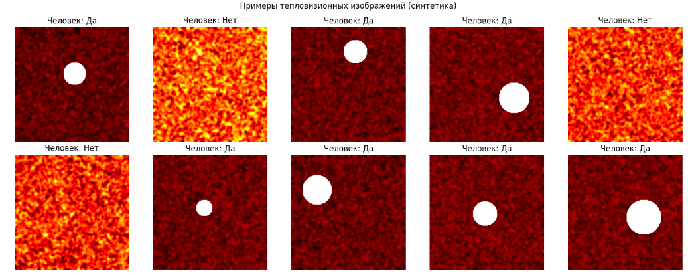

# 🚁 Дрон-спасатель для подземных горных работ


## 📌 Суть проекта

Разработка дрона-спасателя для обнаружения людей под завалами в шахтах с использованием:
- **Тепловизионной камеры** (машинное зрение на основе ResNet18)
- **Датчиков газа** (CH4, CO, H2S)
- **Автоматического принятия решений**

**Ожидаемый результат:** снижение риска для спасателей и ускорение поиска пострадавших.

---

## 🛠 Стек технологий

| Компонент | Технология |
|-----------|------------|
| Язык программирования | Python 3.10 |
| Фреймворк для ИИ | PyTorch 2.0 |
| Архитектура модели | ResNet18 (transfer learning) |
| Обработка изображений | OpenCV, torchvision |
| Визуализация | Matplotlib, Seaborn |
| Веб-интерфейс | Gradio |
| Научные вычисления | NumPy, SciPy, Scikit-learn |

---

## 📊 Описание датасета

**Синтетический датасет тепловизионных изображений:**

| Параметр | Значение |
|----------|----------|
| Количество образцов | 2000 |
| Размер изображений | 224×224 пикселя |
| Количество каналов | 1 (тепловой) |
| Классы | 2 (есть человек / нет человека) |

**Примеры изображений из датасета:**



## 🧠 Архитектура модели

```python
ThermalRescueNet(
  backbone = ResNet18 (pretrained)
  conv1 = Conv2d(1, 64)  # адаптация под тепловой канал
  fc = Sequential(
    Dropout(0.5),
    Linear(512 → 128),
    ReLU(),
    Dropout(0.3),
    Linear(128 → 2)
  )
)
